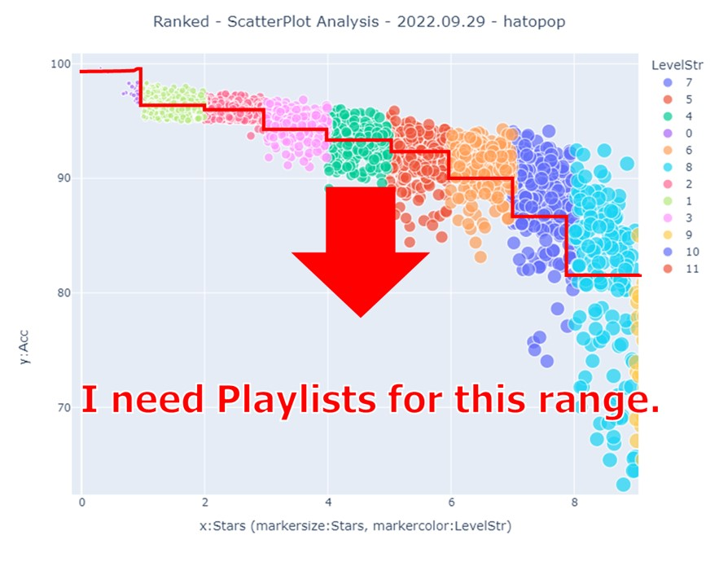
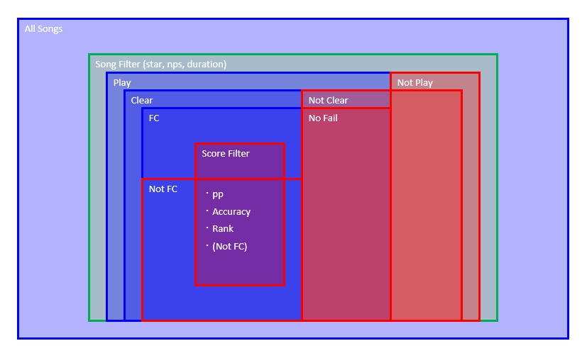

# MyBSList

[日本語](README_JP.md)

This tool creates a various playlist for each star using ScoreSaber data.


I need a playlist below the red line.
This tool helps with that.



This tool creates playlists for the following red ranges.



## Confirmation of operation

This program has been tested only on the following environments
- Windows 10 pro 64bit

## installation

Download the latest zip file from [release](https://github.com/hatopopvr/MyBSList/releases) and unzip it at any location.

## Update

Overwrite the `MyBSList` directory. If it does not work, delete the work and log directories and then run `MyBSList.exe`.

## How to use

### Configuration

1. Open `config.ini` and set the following according to your environment.  
The Playlists directory is located in `[Beat Saber installation directory]\Playlists`.

```ini
[user]
# ScoreSaber PlayerID, must be changed.
player_id = 76561198412839195

# Directry of BeatSaber playlists
playlist_dir = C:\Program Files (x86)\Steam\steamapps\common\Beat Saber\Playlists
```

2. Open `playlist_config.json` and set the conditions for creating the playlist.  
The `playlist_config.json` contains the settings I use.  
Use it as a reference and edit it to create your own configuration.  

```json
    {
        "list_name": "star00",                      # Name of playlist
        "image_path": "images/img_star_00.png",     # Path of playlist image
        "playlist_is_enable": "True",               # Whether to create this playlist
        # flag
        "not_play_is_enable": "True",               # whether to include not played scores in the playlist | True : include
        "nf_is_enable": "True",                     # whether to include NoFail scores in playlist | True : include
        "not_fc_is_enable": "False",                # whether to include not FullCombo scores in playlist | True : include
        "scorefilter_is_enable": "True",            # whether to include cleared scores in the playlist if they match the following score filters | True : include
        # song filter for all ranked songs
        "star_min": 0,                              # lower limit of star               
        "star_max": 1,                              # upper limit of star
        "nps_min": 0,                               # lower limit of nps 
        "nps_max": 20,                              # upper limit of nps 
        "duration_min": 0,                          # lower limit of duration (Unit: seconds)
        "duration_max": 1000,                       # upper limit of duration (Unit: seconds)
        # score filter for cleared song
        "scorefilter_pp_min": 0,                    # lower limit of pp
        "scorefilter_pp_max": 1000,                 # upper limit of pp
        "scorefilter_acc_min": 0,                   # lower limit of accuracy
        "scorefilter_acc_max": 98,                  # upper limit of accuracy
        "scorefilter_miss_min": 0,                  # lower limit of sum of Bad+Miss cut
        "scorefilter_miss_max": 10000,              # Upper limit of sum of Bad+Miss cut
        "scorefilter_rank_min": 0,                  # lower limit of global rank     
        "scorefilter_rank_max": 999999              # upper limit of global rank
    },
```

### Execution

Execute `MyBSList.exe` by double-clicking it.
If the following contents are output to the console after execution, it should be completed normally.
Run `Refresh Playlist` in the BeatSaber game screen and check if the playlist for each star is created.

```log
2022-10-10 18:17:29,901 -     INFO - -----------------[start]------------------
2022-10-10 18:17:29,901 -     INFO - Creating working directory.
2022-10-10 18:17:29,901 -     INFO - Work directory creation complete. path:work
2022-10-10 18:17:29,902 -     INFO - Getting player information.
2022-10-10 18:17:30,498 -     INFO - Retrieving player info. hatopop, TotalPlayCount:3,194, RankedPlayCount:2,872, Pages:33
2022-10-10 18:17:30,499 -     INFO - Getting ranked map data.
2022-10-10 18:17:33,396 -     INFO - Retrieving ranked map data completed. path:work\outcome.csv, count:3,420
2022-10-10 18:17:33,397 -     INFO - Collating ranked map count from LeaderBoard.
2022-10-10 18:17:34,035 -     INFO - Ranked map count is 3,420.
2022-10-10 18:17:34,037 -     INFO - Ranked map counts matched. Completing re-acquisition process.
2022-10-10 18:17:34,038 -     INFO - Retrieving Player Score information from ScoreSaber.
2022-10-10 18:17:35,736 -     INFO - Retrieving Player Score information completed. RankedPlayCount is 2,872.
2022-10-10 18:17:35,737 -     INFO - Start recalculating Acc based on number of notes and combos.
2022-10-10 18:17:35,743 -     INFO - There are 42 results where the Accuracy is different from the game.
2022-10-10 18:17:35,744 -     INFO - Accuracy recalculated results overwritten.
2022-10-10 18:17:35,744 -     INFO - Creating merged data.
2022-10-10 18:17:35,789 -     INFO - Merge complete. Count:3,420
2022-10-10 18:17:35,789 -     INFO - Clean playlist in work & playlists directory for MyBSList.
2022-10-10 18:17:35,806 -     INFO - Playlist clean in working & playlists directory complete. count:23, 23
2022-10-10 18:17:35,806 -     INFO - <<Playlist creation in working directory start.>>
2022-10-10 18:17:35,824 -     INFO - Playlist: work/playlists/star00.json, Count:18
2022-10-10 18:17:35,843 -     INFO - Playlist: work/playlists/star01.json, Count:38
2022-10-10 18:17:35,869 -     INFO - Playlist: work/playlists/star02.json, Count:123
2022-10-10 18:17:35,892 -     INFO - Playlist: work/playlists/star03.json, Count:70
2022-10-10 18:17:35,914 -     INFO - Playlist: work/playlists/star04.json, Count:57
2022-10-10 18:17:35,937 -     INFO - Playlist: work/playlists/star05.json, Count:71
2022-10-10 18:17:35,953 -     INFO - Playlist: work/playlists/star06.json, Count:15
2022-10-10 18:17:35,965 -     INFO - Playlist: work/playlists/star06_pp.json, Count:36
2022-10-10 18:17:35,975 -     INFO - Playlist: work/playlists/star07_task.json, Count:29
2022-10-10 18:17:35,989 -     INFO - Playlist: work/playlists/star07_not.json, Count:1
2022-10-10 18:17:36,001 -     INFO - Playlist: work/playlists/star07_pp.json, Count:26
2022-10-10 18:17:36,013 -     INFO - Playlist: work/playlists/star08_task.json, Count:38
2022-10-10 18:17:36,032 -     INFO - Playlist: work/playlists/star08_not.json, Count:109
2022-10-10 18:17:36,043 -     INFO - Playlist: work/playlists/star08_nf.json, Count:8
2022-10-10 18:17:36,053 -     INFO - Playlist: work/playlists/star08_pp.json, Count:12
2022-10-10 18:17:36,073 -     INFO - Playlist: work/playlists/star09_not_play.json, Count:129
2022-10-10 18:17:36,086 -     INFO - Playlist: work/playlists/star09_nf.json, Count:34
2022-10-10 18:17:36,099 -     INFO - Playlist: work/playlists/star09_task.json, Count:56
2022-10-10 18:17:36,133 -     INFO - Playlist: work/playlists/star10.json, Count:214
2022-10-10 18:17:36,146 -     INFO - Playlist: work/playlists/star10_nf.json, Count:34
2022-10-10 18:17:36,173 -     INFO - Playlist: work/playlists/star11.json, Count:126
2022-10-10 18:17:36,183 -     INFO - Playlist: work/playlists/star11_nf.json, Count:1
2022-10-10 18:17:36,199 -     INFO - Playlist: work/playlists/star12.json, Count:8
2022-10-10 18:17:36,208 -     INFO - <<Playlist creation in working directory complete.>>
2022-10-10 18:17:36,208 -     INFO - Copy and paste the playlists into the playlists directory.
2022-10-10 18:17:36,301 -     INFO - 23 playlists have been completed.:C:\Program Files (x86)\Steam\steamapps\common\Beat Saber\Playlists
2022-10-10 18:17:36,301 -     INFO - ----------------[complete]-----------------
```

### Remarks

- It is convenient to register `MyBSList.exe` in a launcher, etc. and call it each time.
- The specification is preliminary and may change significantly in the future.

## Data
- Score Data from [ScoreSaber](https://scoresaber.com/) Public API - [doc](https://docs.scoresaber.com/)  
- Ranked Map Data from RankedMapData by [rakkyo150](https://twitter.com/rakkyo150) - [RankedMapData](https://github.com/rakkyo150/RankedMapData)  


## License

This software is released under the [MIT License](https://github.com/hatopopvr/MyBSList/blob/main/LICENSE).  
Please refer to [exe_used_license](https://github.com/hatopopvr/MyBSList/blob/main/exe_used_license) for the licenses used in the binaries distributed.

## Contact
Twitter [@hatopop_vr](https://twitter.com/hatopop_vr)
